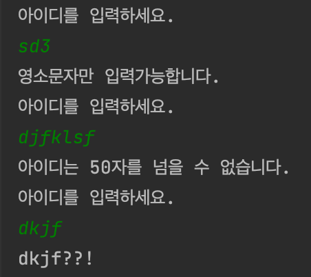

## Day1_Quiz1

<br />
<br />

### 문제
---
준하는 사이트에 회원가입을 하다가 joonas라는 아이디가 이미 존재하는 것을 보고 놀랐다. 준하는 놀람을 ??!로 표현한다. 준하가 가입하려고 하는 사이트에 이미 존재하는 아이디가 주어졌을 때, 놀람을 표현하는 프로그램을 작성하시오.

<br />
<br />

### 입력
---
첫째 줄에 준하가 가입하려고 하는 사이트에 이미 존재하는 아이디가 주어진다. 아이디는 알파벳 소문자로만 이루어져 있으며, 길이는 50자를 넘지 않는다.

<br />
<br />

### 출력
---
첫째 줄에 준하의 놀람을 출력한다. 놀람은 아이디 뒤에 ??!를 붙여서 나타낸다.

<br />
<br />


### 예제 입력1
---
joonas

<br />
<br />

### 예제 출력1
---
joonas??!

<br />
<br />

### 내가 짠 코드
---
```java
public class D1 {
    public static void main(String[] args) {
        Scanner scanner = new Scanner(System.in);

        while(true) {
            System.out.println("아이디를 입력하세요. ");
            String scanId = scanner.nextLine();
            int idLength = scanId.length();

            if(idLength > 5) {
                System.out.println("아이디는 50자를 넘을 수 없습니다.");
                continue;
            }

            boolean b = true;
            for(int i=0; i<idLength; i++) {
                char a = scanId.charAt(i);
                int asc = (int) a;

                if(asc<97 || asc>122) {
                    System.out.println("영소문자만 입력가능합니다.");
                    b = false;
                    break;
                }

            }

            if(b) {
                System.out.println(scanId + "??!");
                break;
            }

        }

    }

}
```
<br />
<br />

### 결과
---


<br />
<br />

### 참고
---
- [예외처리 연습 : 두가지 범위 설정하기 [ 영문과 숫자만 입력가능 / ID ]](https://javappo.tistory.com/38)
- [[자바 프로그래밍 기초] 4. charAt()에 대해서 알아보자](https://colossus-java-practice.tistory.com/31)