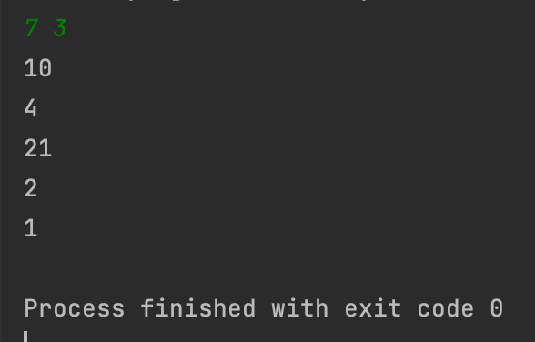

## Day2_Quiz1
문제를 푼 날짜 : 23/11/30
<br />
<br />

### 백준 10869번 문제
---
두 자연수 A와 B가 주어진다. 이때, A+B, A-B, A*B, A/B(몫), A%B(나머지)를 출력하는 프로그램을 작성하시오. 

<br />


#### 1. 입력
```
두 자연수 A와 B가 주어진다. 
```


<br />

#### 2. 출력
```
첫째 줄에 A+B, 둘째 줄에 A-B, 셋째 줄에 A*B, 넷째 줄에 A/B, 다섯째 줄에 A%B를 출력한다.
```

<br />


#### 3. 제한
```
1 ≤ A, B ≤ 10,000
```
### 내가 짠 코드
---
[코드로 이동](/algorithm-study-project/src/w1/d1/ArithmeticCalculator.java)

<br />
<br />

### 예제
---
#### 입력 1
```
7 3
```

#### 출력 1
```
10
4
21
2
1
```

<br />
<br />

### 실행 결과
---


<br />
<br />

### 참고
---

<br />
<br />

### 출처
---
[백준 '사칙연산'](https://www.acmicpc.net/problem/10869)
