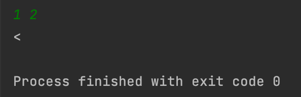
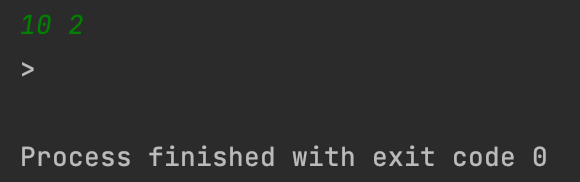
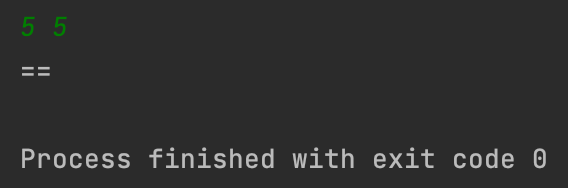
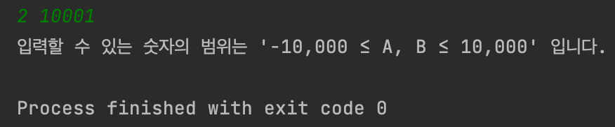

## Day1_Quiz1
문제를 푼 날짜 : 23/12/04
<br />
<br />

### 백준 1330번 문제
---
두 정수 A와 B가 주어졌을 때, A와 B를 비교하는 프로그램을 작성하시오.

<br />


#### 1. 입력
```
첫째 줄에 A와 B가 주어진다. A와 B는 공백 한 칸으로 구분되어져 있다.
```


<br />


#### 2. 출력
```
첫째 줄에 다음 세 가지 중 하나를 출력한다.
A가 B보다 큰 경우에는 `>`를 출력한다.
A가 B보다 작은 경우에는 `<`를 출력한다.
A와 B가 같은 경우에는 `==`를 출력한다.
```

<br />


#### 3. 제한
```
-10,000 ≤ A, B ≤ 10,000
```

<br />
<br />

### 내가 짠 코드
---
[코드로 이동](/algorithm-study-project/src/w2/d1/CompareTwoNum.java)

<br />
<br />

### 예제
---
#### 입력 1
```
1 2
```

#### 출력 1
```
<
```

<br />

#### 입력 2
```
10 2
```


#### 출력 2
```
>
```

<br />


#### 입력3
```
5 5
```

#### 출력3
```
==
```

<br />
<br />

### 실행 결과
---






- 범위 밖의 숫자를 입력했을 경우


<br />
<br />

### 참고
---

<br />
<br />

### 출처
---
[백준 '두 수 비교하기'](https://www.acmicpc.net/problem/1330)