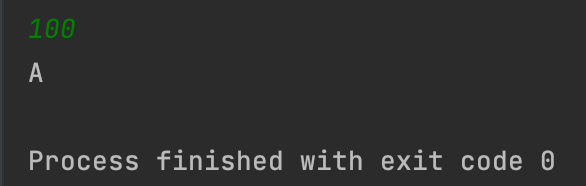

## Day1_Quiz2
문제를 푼 날짜 : 23/12/04
<br />
<br />

### 백준 9498번 문제
---
시험 점수를 입력받아 90 - 100점은 A, 80 - 89점은 B, 70 - 79점은 C, 60 - 69점은 D, 나머지 점수는 F를 출력하는 프로그램을 작성하시오.

<br />


#### 1. 입력
```
첫째 줄에 시험 점수가 주어진다. 
```


<br />


#### 2. 출력
```
시험 성적을 출력한다.
```

<br />


#### 3. 제한
```
시험 점수는 0보다 크거나 같고, 100보다 작거나 같은 정수이다.
```

<br />
<br />

### 내가 짠 코드
---
[코드로 이동](/algorithm-study-project/src/w2/d1/TestResults.java)

<br />
<br />

### 예제
---
#### 입력 1
```
100
```

#### 출력 1
```
A
```

<br />
<br />

### 실행 결과
---



- 범위 밖의 숫자를 입력했을 경우


<br />
<br />

### 참고
---
[입력받은 값이 숫자인지 확인하는 메서드](https://dev-junku.tistory.com/14)
<br />
<br />

### 출처
---
[백준 '시험성적'](https://www.acmicpc.net/problem/9498)