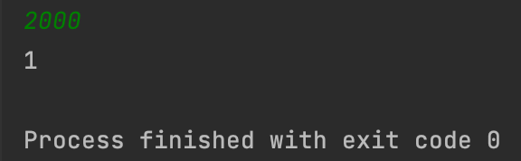
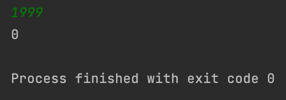
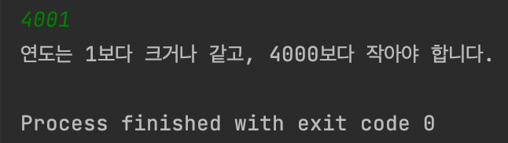

## Day1_Quiz2
문제를 푼 날짜 : 23/12/05
<br />
<br />

### 백준 2753번 문제
---
연도가 주어졌을 때, 윤년이면 1, 아니면 0을 출력하는 프로그램을 작성하시오.

윤년은 연도가 4의 배수이면서, 100의 배수가 아닐 때 또는 400의 배수일 때이다.

예를 들어, 2012년은 4의 배수이면서 100의 배수가 아니라서 윤년이다. 1900년은 100의 배수이고 400의 배수는 아니기 때문에 윤년이 아니다. 하지만, 2000년은 400의 배수이기 때문에 윤년이다.

<br />


#### 1. 입력
```
첫째 줄에 연도가 주어진다. 
```


<br />


#### 2. 출력
```
첫째 줄에 윤년이면 1, 아니면 0을 출력한다.
```

<br />


#### 3. 제한
```
연도는 1보다 크거나 같고, 4000보다 작거나 같은 자연수이다. 
```

<br />
<br />

### 내가 짠 코드
---
[코드로 이동](/algorithm-study-project/src/w2/d2/LeapYear.java)

<br />
<br />

### 예제
---
#### 입력 1
```
2000
```

#### 출력 1
```
1
```

<br />

#### 입력 2
```
1999
```

#### 출력 2
```
0
```

<br />
<br />

### 실행 결과
---






<br />
<br />

범위 밖의 숫자를 입력했을 경우




<br />
<br />

### 참고
---

<br />
<br />

### 출처
---
[백준 '윤년'](https://www.acmicpc.net/problem/2753)