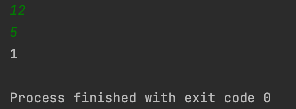
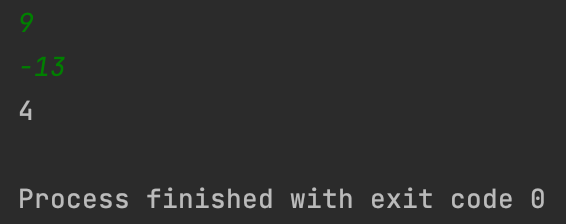

## Day3_Quiz1
문제를 푼 날짜 : 23/12/06
<br />
<br />

### 백준 14681번 문제
---
흔한 수학 문제 중 하나는 주어진 점이 어느 사분면에 속하는지 알아내는 것이다. 사분면은 아래 그림처럼 1부터 4까지 번호를 갖는다. "Quadrant n"은 "제n사분면"이라는 뜻이다.

[그림링크](https://www.acmicpc.net/problem/14681)

예를 들어, 좌표가 (12, 5)인 점 A는 x좌표와 y좌표가 모두 양수이므로 제1사분면에 속한다. 점 B는 x좌표가 음수이고 y좌표가 양수이므로 제2사분면에 속한다.

점의 좌표를 입력받아 그 점이 어느 사분면에 속하는지 알아내는 프로그램을 작성하시오. 단, x좌표와 y좌표는 모두 양수나 음수라고 가정한다.

<br />
<br />

#### 1. 입력
```
첫 줄에는 정수 x가 주어진다. 
다음 줄에는 정수 y가 주어진다.
```


<br />

#### 2. 출력
```
점 (x, y)의 사분면 번호(1, 2, 3, 4 중 하나)를 출력한다.
```
<br />

#### 3. 제한
```
(−1000 ≤ x ≤ 1000; x ≠ 0) 
(−1000 ≤ x ≤ 1000; x ≠ 0) 
```

<br />
<br />

### 내가 짠 코드
---
[코드로 이동](/algorithm-study-project/src/w2/d3/Quadrant.java)
<br />
<br />


### 예제
---
#### 입력 1
```
12
5
```
#### 출력 1
```
1
```
#### 입력 2
```
9
-13
```
#### 출력 2
```
4
```

<br />
<br />


### 실행 결과
---



<br />
<br />

### 참고
---


<br />
<br />

### 출처
---
[백준 '사분면 고르기'](https://www.acmicpc.net/problem/14681)